# AWS DevOps: Continuous Docker Deployment to AWS Fargate from GitHub using Terraform

	
	
	
	
	

## Solution architecture

The following diagram shows the flow of events in the solution:

## Introduction

In the ever-evolving landscape of DevOps practices, the ability to streamline and automate application deployment processes is crucial. In this article, we will explore a hands-on guide for achieving Continuous Docker Deployment to AWS Fargate from a GitHub repository using Terraform. This DevOps pipeline will allow developers to push code changes to a GitHub repository and have them automatically deployed to an AWS Fargate cluster.

## AWS Key Components

The provided Terraform code leverages these AWS services to create an automated deployment pipeline for your application, ensuring scalability, reliability, and security throughout the process.

1. **Amazon Virtual Private Cloud (VPC):** Is a secure, isolated private cloud hosted.
1. **Amazon Subnets:** Public and private subnets within the VPC for isolating resources based on security requirements.
1. **Amazon Internet Gateway (IGW):** Provides internet connectivity to instances in the public subnets.
1. **Amazon NAT Gateway:** Enables instances in the private subnets to initiate outbound traffic to the internet while preventing incoming connections.
1. **Amazon Security Group (SG):** Defines inbound and outbound traffic rules to control network access to instances.
1. **Amazon Application Load Balancer (ALB):** Distributes incoming application traffic across multiple targets, such as Amazon ECS containers.
1. **Amazon ECS Cluster:** Manages containers using the AWS Fargate launch type, abstracting the underlying infrastructure.
1. **Amazon ECS Task Definition:** Specifies the parameters for running containers within an Amazon ECS service.
1. **Amazon Elastic Container Registry (ECR):** A fully managed Docker container registry that stores, manages, and deploys container images.
1. **Amazon IAM Roles and Policies:** Define permissions for different services, allowing them to interact securely.
1. **AWS CodeBuild Project:** Builds, tests, and packages your source code, producing a ready-to-deploy container image.
1. **AWS CodePipeline:** Creates an end-to-end CI/CD pipeline that automates the build, test, and deployment process.
1. **Amazon CloudWatch Event Rule:** Monitors changes in the CodeBuild build status and triggers notifications.
1. **Amazon SNS Topic:** Allows publishing and subscribing to notifications and messages.
1. **IAM Roles for CodePipeline and CodeBuild:** Provides permissions for the pipeline and build processes to access required resources.
1. **IAM Policies:** Define permissions for roles to access necessary AWS services and resources.

## Project Workflow

Here's the project workflow for the provided Terraform code that sets up a Continuous Docker Deployment to AWS Fargate from GitHub using Terraform:

1. **VPC and Networking:** Create a VPC with specified CIDR blocks, public and private subnets across availability zones, an IGW for public subnet communication, configure NAT Gateway for private subnet outbound communication and set up route tables for public and private subnets.
1. **Security Group:** Create a security group for the ALB. Allow incoming traffic on ports 80 and 5000 for the ALB. Allow all outbound traffic.
1. **Application Load Balancer (ALB):** Create an ALB with specified attributes and subnets and set up ALB target groups and listeners.
1. **Amazon ECS Cluster and Task Definition:** Create an ECS cluster, define an ECS task definition for the application, configure the container definition for the Flask app, an IAM policy for ECS task execution.
1. **IAM Roles and Policies for CodePipeline and CodeBuild:** Define IAM roles for CodePipeline and CodeBuild, IAM policies with necessary permissions for ECS, S3, CloudWatch Logs, and attach the policies to the respective roles.
1. **Amazon CodeBuild Project:** Set up an Amazon CodeBuild project, configure the project to build from the specified GitHub repository and define build environment, source, and artifacts.
1. **Amazon CodePipeline:** Create an Amazon CodePipeline with a source stage from GitHub, configure the source webhook for GitHub repository, create a build stage using the CodeBuild project and define an S3 artifact store.
1. **Amazon SNS Topic:** Create an Amazon SNS topic for CodeBuild notifications, configure topic policy to allow CloudWatch Events to publish to the topic and create an IAM role for CloudWatch Events.
1. **CloudWatch Events:** Set up a CloudWatch Events rule to capture CodeBuild state changes and define event pattern to capture IN_PROGRESS, SUCCEEDED, FAILED, and STOPPED states.
1. **CloudWatch Events Target and Notification:** Configure CloudWatch Events to target the SNS topic and subscribe the specified email address to the SNS topic for notifications.
1. **Amazon ECR Repository:** Create an ECR repository for Docker images.
1. **Docker Image Build and Push:** Use a local-exec provisioner to build and push the Docker image to the ECR repository.
1. **Deployment to Fargate with CodePipeline:** The CodePipeline deployment stage will automatically deploy the new Docker image to ECS Fargate and the application will be available through the ALB.

It's a comprehensive DevOps workflow that ensures continuous deployment of Docker applications to AWS Fargate while providing notifications and monitoring through SNS and CloudWatch.

## Getting Started 

### Prerequisites

Before we dive into the details of the deployment pipeline, make sure you have the following prerequisites in place:

- **AWS account**: With permissions to create resources specified in the code.
- **Fork GitHub Repo**: Fork and clone your own [Yris-ops/aws-devops-continuous-docker-deployment-to-aws-fargate](https://github.com/Yris-ops/aws-devops-continuous-docker-deployment-to-aws-fargate) GitHub repository.
- **GitHub Token**: Create an token in GitHub and provide access to the repo scopes.
- **Terraform**: Installed on your local machine.
- **Docker**: Installed on your local machine.

### Implementation 

Terraform: All the resource provisioning for this solution is written in a Terraform configuration, which is available in the GitHub repository.

### Deployment Steps

1. **Clone** this repo on the local machine.
1. **Fork** this repo on your GitHub account.
1. **Modify** the necessary parameters in the vars.tf file to suit your needs, such as region, VPC parameters, GitHub token, nomenclatures, etc.
1. **Deploy** the Terraform configuration with the following command: `terraform init && terraform apply --auto-approve`.
1. **Wait** 5 to 10 minutes until all resources are deployed.

### Key Components for Continuous Deployment on AWS Fargate

1. **Virtual Private Cloud (VPC)**: 

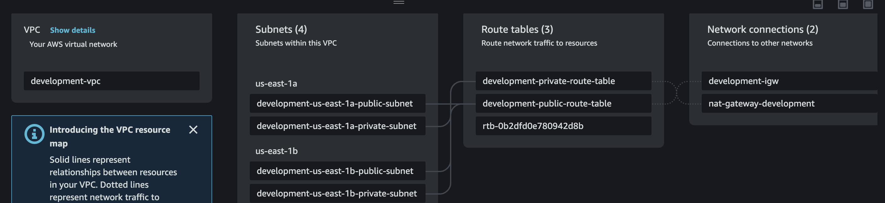

The VPC defines an isolated network in the cloud where you can deploy your AWS resources. It's used to host your subnets, security groups, alb, and other networking resources.

2. **Subnets**: 

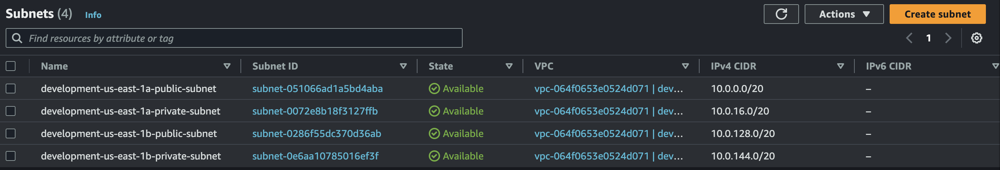

Subnets are logical partitions of your VPC network that can be spread across different availability zones to ensure high availability of your resources. A minimum of 2 AZ is required for alb deployment and resilient architecture.

3. **Internet Gateway**: 

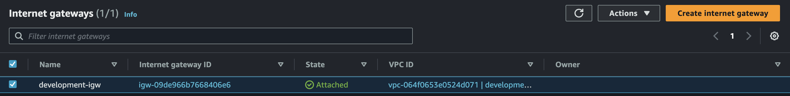

The internet gateway enables your resources in the VPC to communicate with the internet.

4. **NAT Gateway**: 

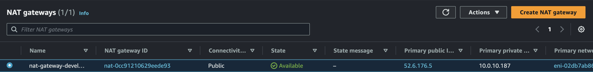

The NAT Gateway allows resources in private subnets to access the internet without directly exposing those resources.

5. **Route Tables**: 

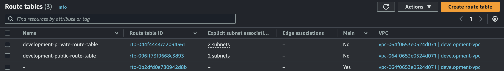

Route tables define how network traffic is directed between different resources within your VPC.

6. **Security Groups**: 

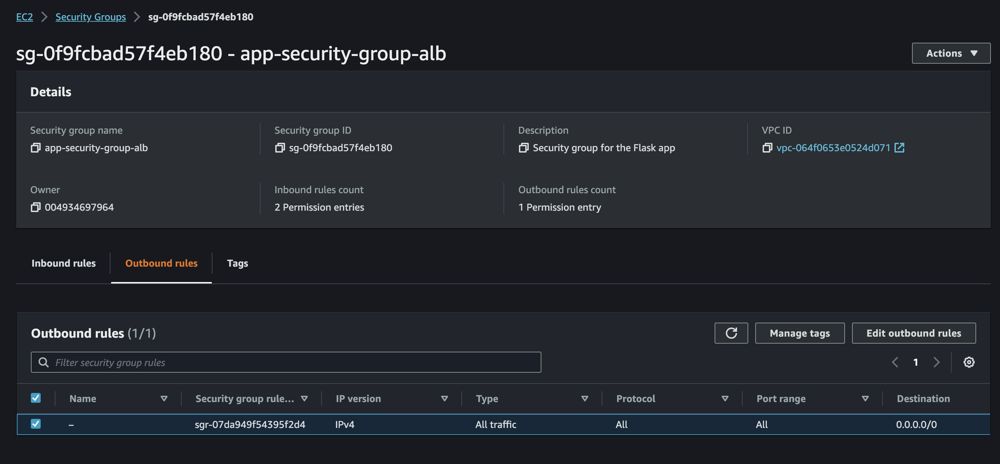

Security groups are virtual firewalls that control incoming and outgoing traffic for your instances. They act as instance-level firewalls.

7. **Elastic Container Service (ECS)**: 

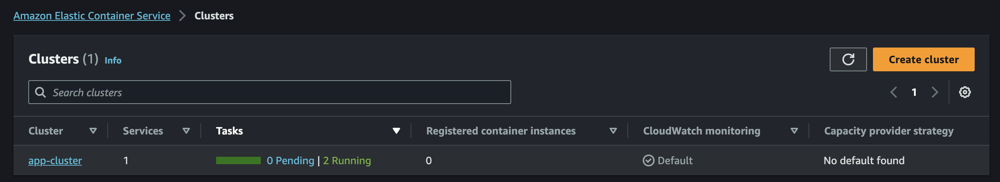

ECS is a container management service that enables you to run and manage containerized applications. It offers flexible deployment options for Docker containers.

8. **ECS Cluster**: 

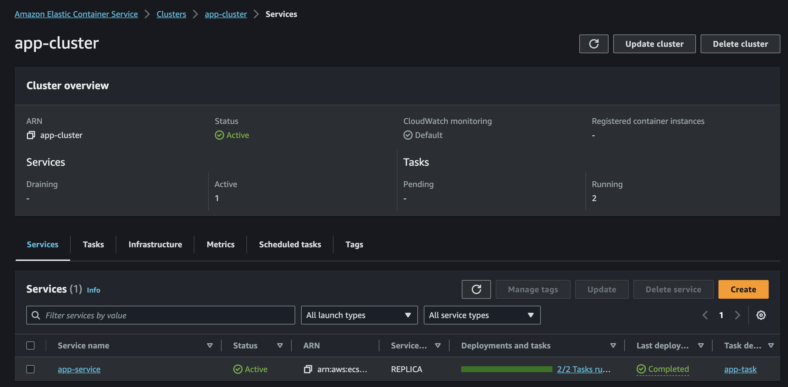

An ECS cluster is a group of EC2 or Fargate resources that allows you to run containerized tasks and services.

9. **Task Definition**: 

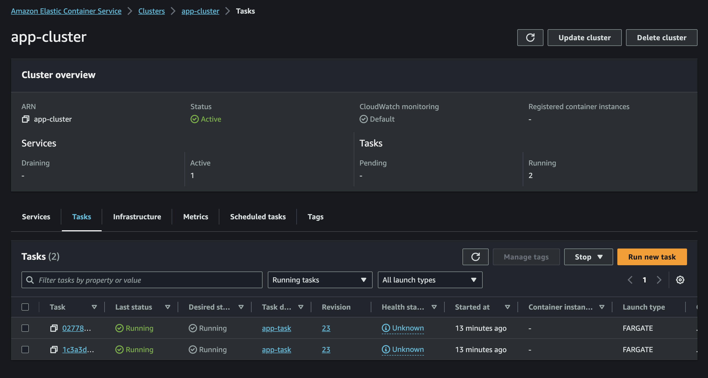

The ECS task definition is a template for defining how a containerized application should run, including Docker images, exposed ports, etc.

10. **IAM Roles and Policies**: 

IAM (Identity and Access Management) is used to manage roles and permissions. In my case, roles and policies are created to 
allow services to authenticate and access other services.

11. **CodePipeline**: 

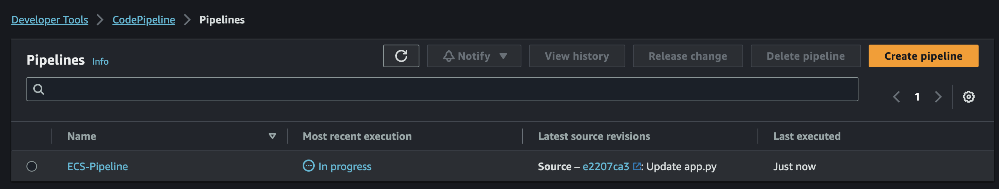

AWS CodePipeline is a continuous deployment service that automates the process of releasing your code changes. It coordinates actions 
such as building, testing, and deploying.

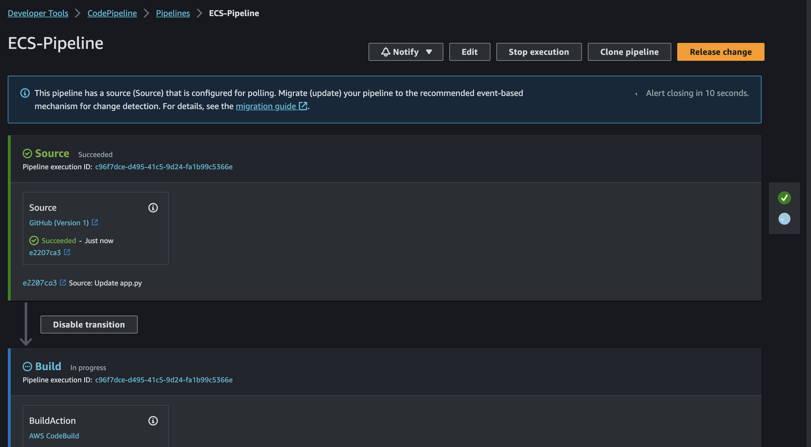

12. **CodeBuild**:

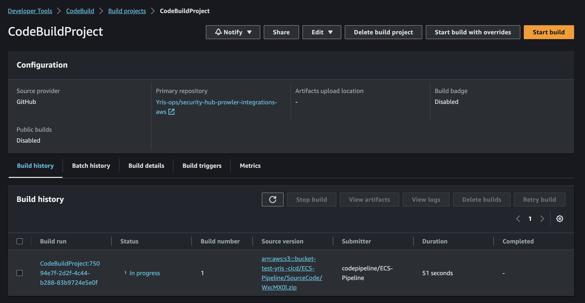

AWS CodeBuild is a fully managed build service that compiles your code, runs tests, and produces deployable artifacts.

13. **S3 (Amazon Simple Storage Service)**: 

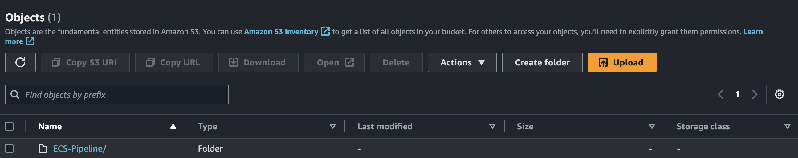

S3 is a scalable object storage service used to store build artifacts.

14. **CloudWatch Events**: CloudWatch Events allows you to monitor and respond to changes in the state of AWS resources. In case, it's used to detect changes in CodeBuild build statuses.

15. **SNS (Simple Notification Service)**: 

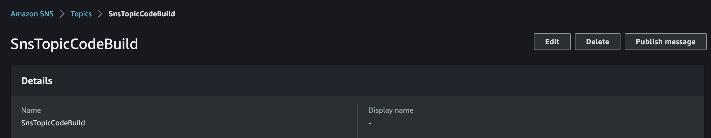

Subscribers to this topic can receive notifications via email, allowing them to stay informed about the status of deployments.

16. **Load Balancer (ALB)**: 

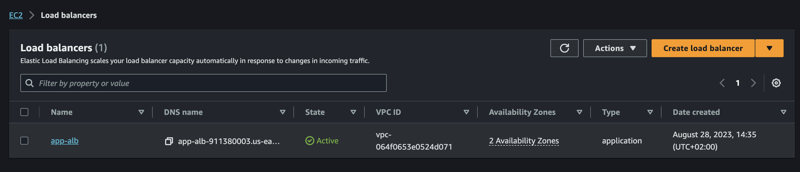

The Application Load Balancer (ALB) distributes incoming traffic across different IPs of your application based on defined routing rules.

17. **Target Groups**: 

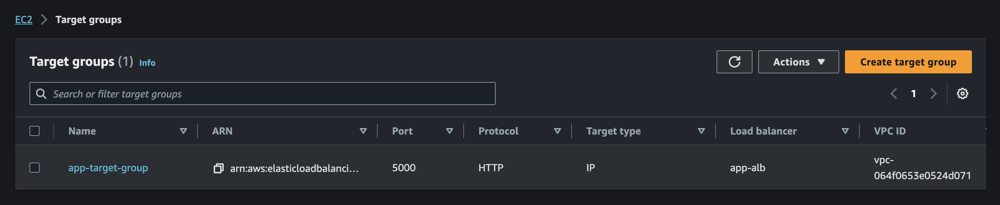

Target groups are used with the load balancer to direct traffic to specific instances based on defined criteria.

18. **GitHub Token**: 

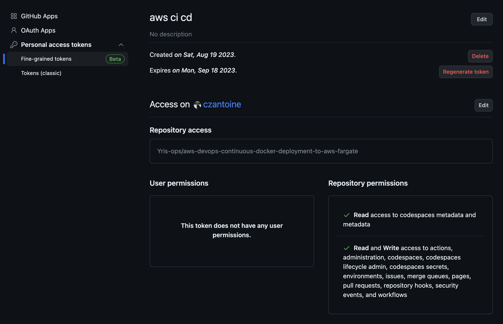

GitHub token with repository access rights.

19. **To Access Application**:

- Copy and paste the Terraform deployment output in your favorite browser.

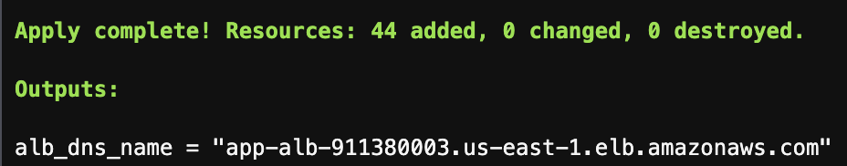

- Go to the AWS Management Console and navigate to the EC2 service and go on Load Balancer section. You can access the application by copy and paste the ALB DNS.

### Let's take a look at the application

### Test Deployment

1. Modify your application's app.py file. Change what you want in the code, text, color, font, text size, etc… Save the changes.
1. Commit the modification to your Github repository.
1. Wait a few minutes for the new tasks to run and go to the ALB DNS to see your application update.

You can follow the update in the CodeBuild and CodePipeline services.

## CleanUp Resources

To clean up the Terraform deployment, you can follow these steps:

1. Open the AWS Management Console and navigate to the S3 Bucket service and empty your S3 Bucket.
1. Navigate to the ECR Repository service and delete your repository.
1. To remove the resources created by this Terraform main.tf, run the following command: terraform destroy --auto-approve
1. Wait the deletion to complete, it may take some time to remove all the resources.

## Conclusion

Implementing a Continuous Docker Deployment pipeline to AWS Fargate from a GitHub repository using Terraform empowers development teams to deliver software efficiently and reliably. Automation reduces the risk of human error and ensures that code changes are quickly and consistently deployed to production environments.

By following the steps outlined in this article, you'll establish a robust deployment process that leverages the power of AWS services, Docker containers, and infrastructure-as-code principles. This approach sets the stage for faster development cycles, better collaboration, and increased confidence in your application deployments.

## Security

See [CONTRIBUTING](CONTRIBUTING.md#security-issue-notifications) for more information.

## License

This repository is licensed under the Apache License 2.0. See the LICENSE file.